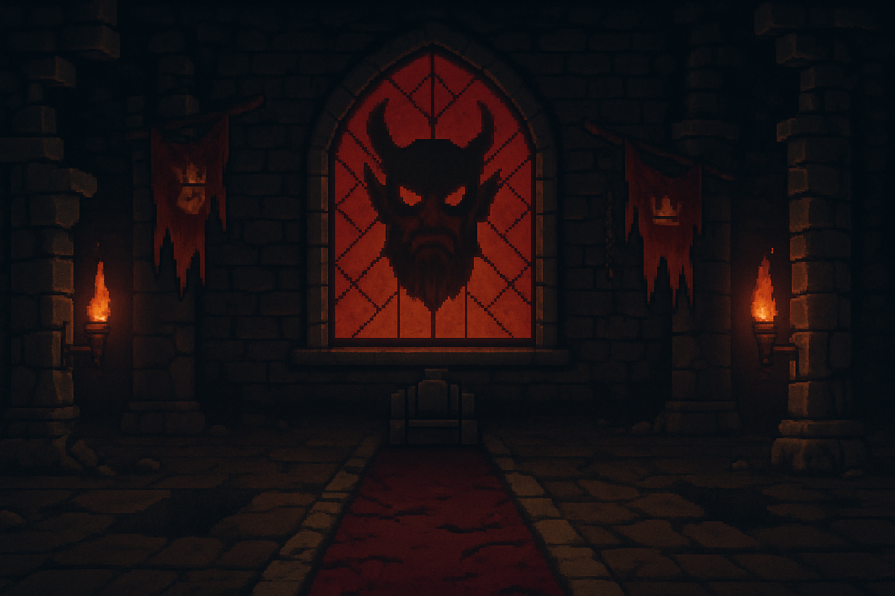

# Nikita Game

2D пиксель-арт платформер на libGDX с мрачной атмосферой, вдохновлённый Hollow Knight и Ori. Главная героиня — принцесса Никита, восстающая против отца-короля, приносящего детей в жертву ради бессмертия.

## Скриншот


## Особенности
- Кинематографичное интро с диалогами и анимацией
- Мрачная атмосфера, глубокий сюжет
- Пиксель-арт графика, эффекты, музыка
- Продуманное стартовое меню (новая игра, продолжить, выйти)
- Поддержка кириллицы, плавные переходы, звуки диалогов
- Система сохранения прогресса

## Управление
- **Стрелки / WASD** — движение
- **Пробел / E** — действие, продолжить диалог
- **Мышь** — навигация по меню

## Сборка и запуск
1. Установите JDK 17+
2. Клонируйте репозиторий:
   ```
   git clone git@github.com:SCMARS/nikita_game.git
   ```
3. Перейдите в папку проекта и запустите:
   ```
   ./gradlew :lwjgl3:run
   ```

## Атмосфера
- Мрачные замки, жертвоприношения, вечная тьма
- Музыка и эффекты для полного погружения
- Вдохновение: Hollow Knight, Ori, Dark Souls

## Лицензия
MIT. Используйте и дорабатывайте свободно.

# NikitaEscape

A [libGDX](https://libgdx.com/) project generated with [gdx-liftoff](https://github.com/libgdx/gdx-liftoff).

This project was generated with a template including simple application launchers and a main class extending `Game` that sets the first screen.

## Platforms

- `core`: Main module with the application logic shared by all platforms.
- `lwjgl3`: Primary desktop platform using LWJGL3; was called 'desktop' in older docs.

## Gradle

This project uses [Gradle](https://gradle.org/) to manage dependencies.
The Gradle wrapper was included, so you can run Gradle tasks using `gradlew.bat` or `./gradlew` commands.
Useful Gradle tasks and flags:

- `--continue`: when using this flag, errors will not stop the tasks from running.
- `--daemon`: thanks to this flag, Gradle daemon will be used to run chosen tasks.
- `--offline`: when using this flag, cached dependency archives will be used.
- `--refresh-dependencies`: this flag forces validation of all dependencies. Useful for snapshot versions.
- `build`: builds sources and archives of every project.
- `cleanEclipse`: removes Eclipse project data.
- `cleanIdea`: removes IntelliJ project data.
- `clean`: removes `build` folders, which store compiled classes and built archives.
- `eclipse`: generates Eclipse project data.
- `idea`: generates IntelliJ project data.
- `lwjgl3:jar`: builds application's runnable jar, which can be found at `lwjgl3/build/libs`.
- `lwjgl3:run`: starts the application.
- `test`: runs unit tests (if any).

Note that most tasks that are not specific to a single project can be run with `name:` prefix, where the `name` should be replaced with the ID of a specific project.
For example, `core:clean` removes `build` folder only from the `core` project.
